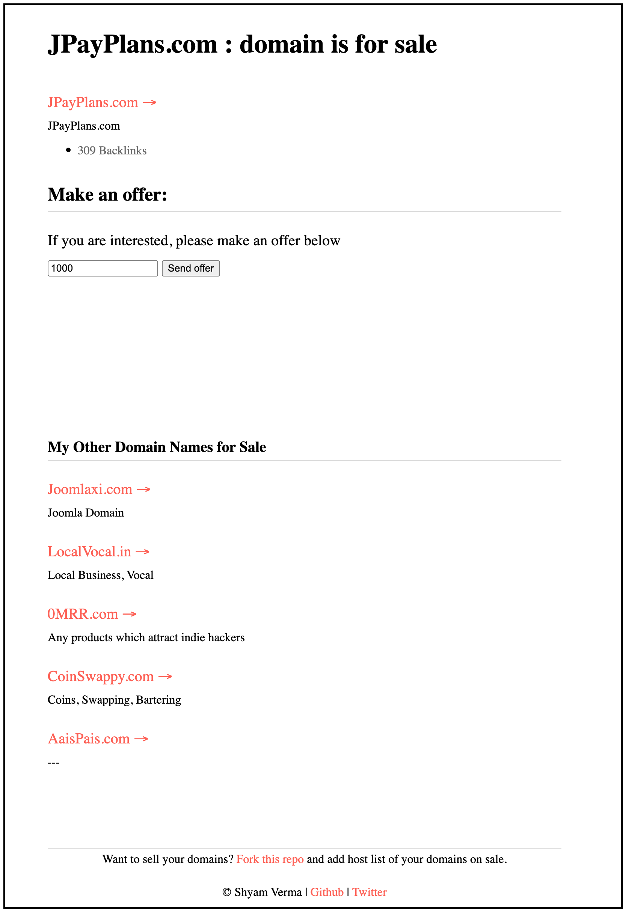

# Create Your Own domain-list for sale
A simple and small webpage to put your domains on sale. 

Example Link: [jpayplans.com](https://jpayplans.com/)

Example Image:

## Customizing Domain List

To customize the list of domains for sale:

1. Fork this repository to your own GitHub account.
2. Open the `index.html` file in your forked repository.
3. Locate the `domains` array in the JavaScript section (around line 20).
4. Modify the array to include your own domains. Each domain should be an object with the following properties:
   - `domain`: The domain name (e.g., 'example.com')
   - `name`: The display name for the domain
   - `description`: A brief description of the domain
   - `link`: The full URL of the domain
   - `price`: (Optional) The asking price for the domain
   - `backlinks`: (Optional) The number of backlinks for the domain

## Deployment

This project can be easily deployed on Vercel. Follow these steps:

1. Push your project to a Git repository (GitHub, GitLab, or Bitbucket).
2. Sign up or log in to [Vercel](https://vercel.com).
3. Click "New Project" and import your repository.
4. Configure your project settings and click "Deploy".

## Connecting Multiple Domains

To connect multiple domains to this project on Vercel:

1. Go to your project's dashboard on Vercel.
2. Navigate to the "Domains" section.
3. Click "Add" to add a new domain.
4. Enter your domain name and follow the DNS configuration instructions.
5. Repeat for each additional domain you want to connect.